Открыв сайт видим кнопку регистрации -> Регаемся на рандомные креды.

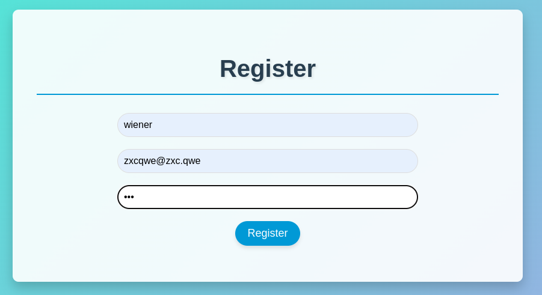
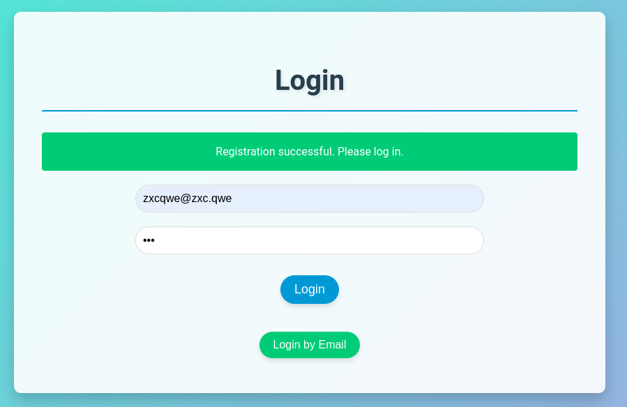

В форме входа видим снизу интересную кнопку снизу Login by Email, она нам еще понадобится, а пока просто заходим.

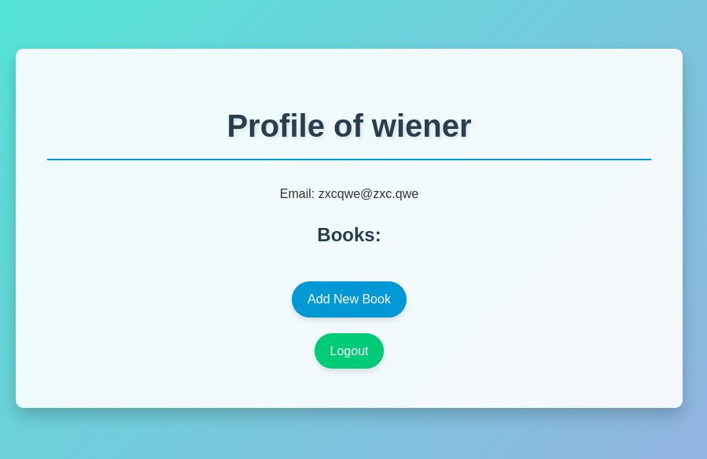

Нас закидывает на наш профиль, добавляем книгу, видим пункт "Private Note", видим что профили создаются по пути /profile/<id>.

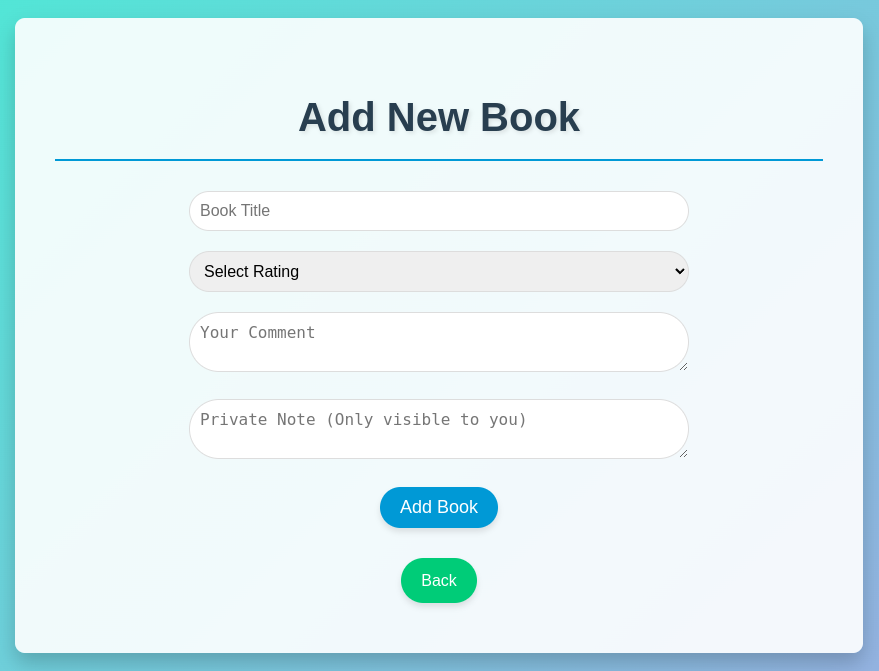

Пробуем пойти по пути /profile/1 и попадаем в профиль админа. Видим Secret Book - Rating: 5
Comment: Something interesting in private note... 

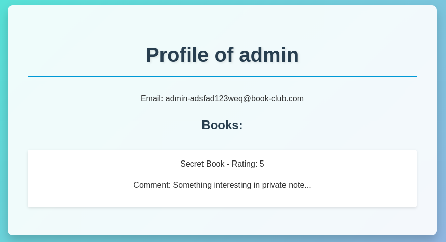

Видим, что книги берутся из апишки, в ней можно увидеть приват ноут и там хинт на решение таски.

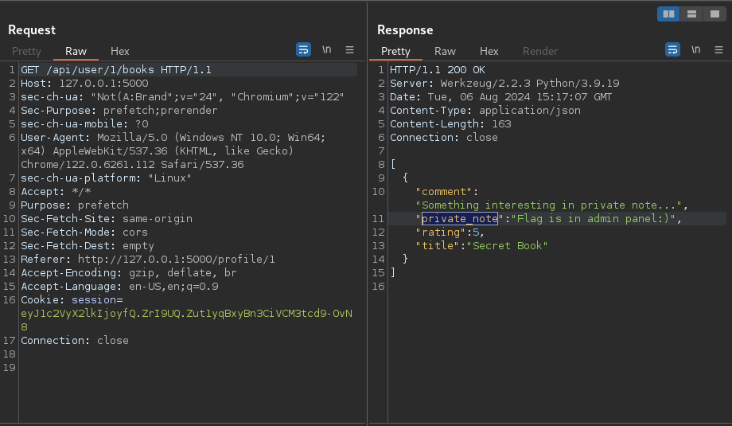

Пробуем войти в /admin, видим 403.

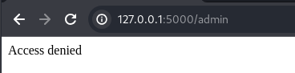

Возвращаемся к кнопке Login by Email, вводим почту админа.

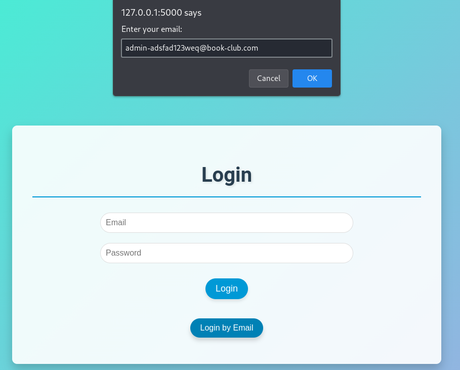

Видим сообщение Token generation started, что намекает нам на возможность наличия race condition, токен не приходит в принципе поэтому просто отправляем пустоту.

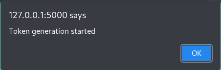
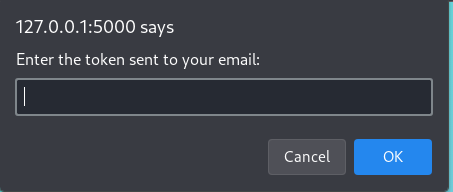

Теперь смотрим два запроса, при входе по почте. 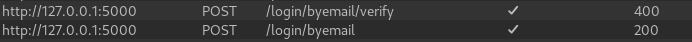
Эти запросы копируем в бурп репитер и делаем из них группу, отправляем их параллельно.

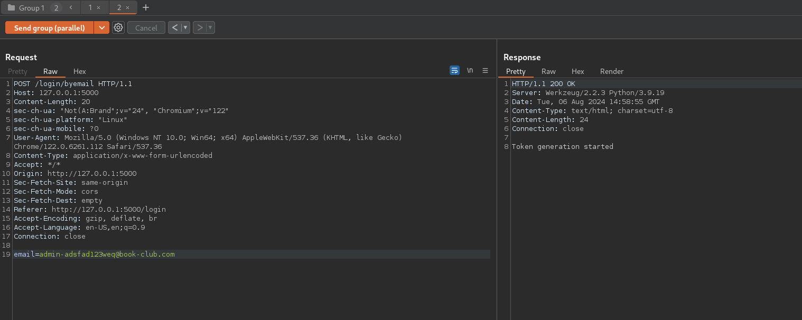
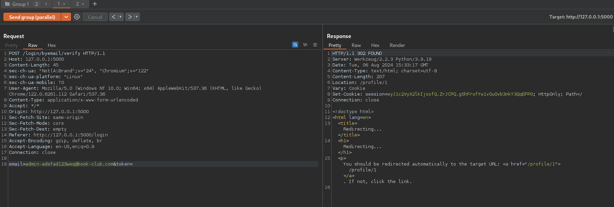

Спустя несколько попыток попадаем в время когда токен еще не сгенерировался и получаем админскую куку.

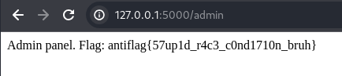

Смотрим флаг :)
